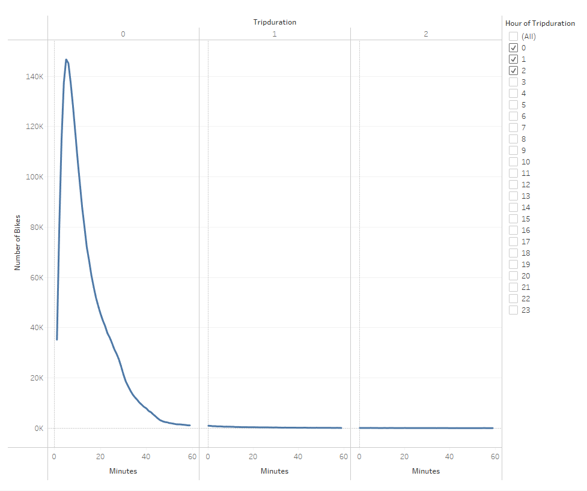
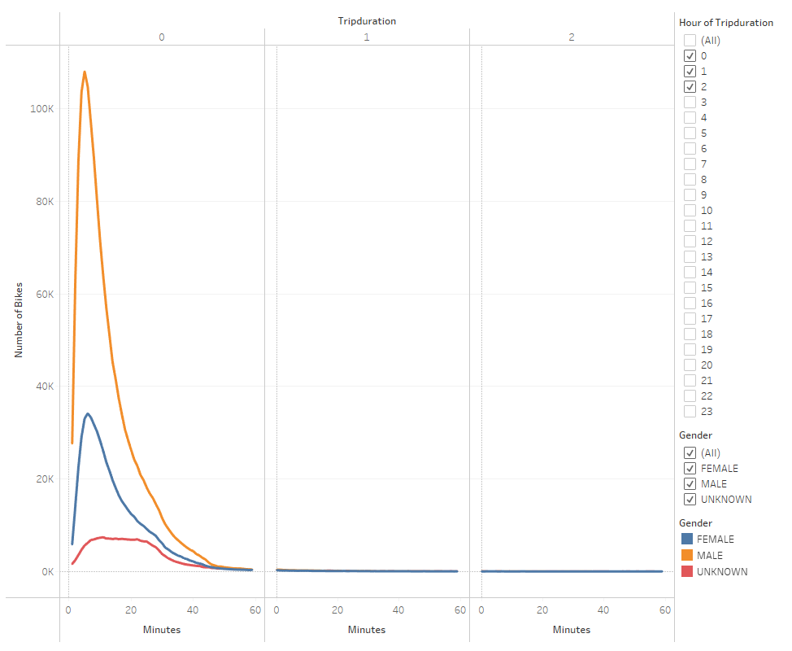
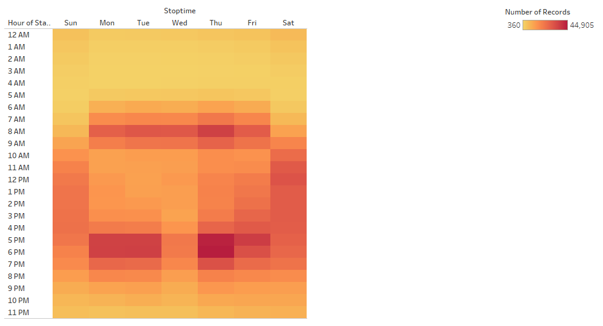
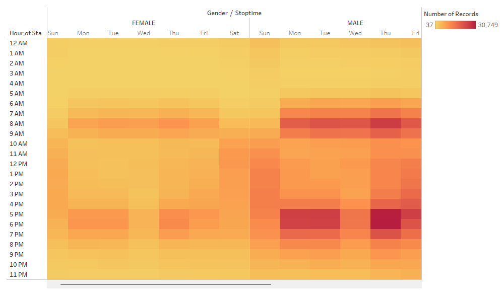
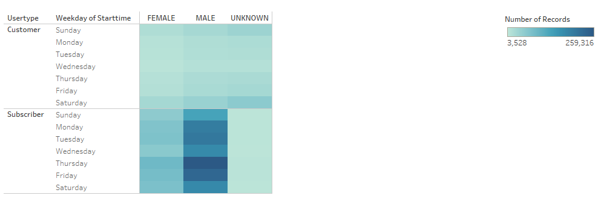
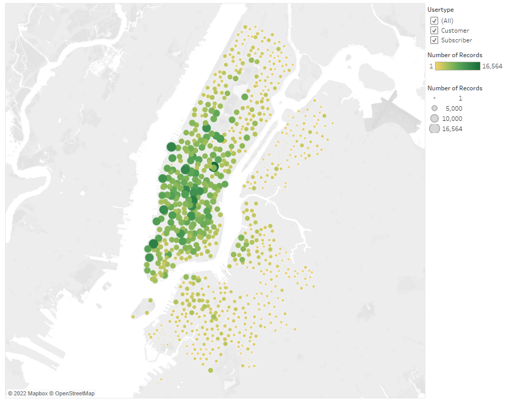
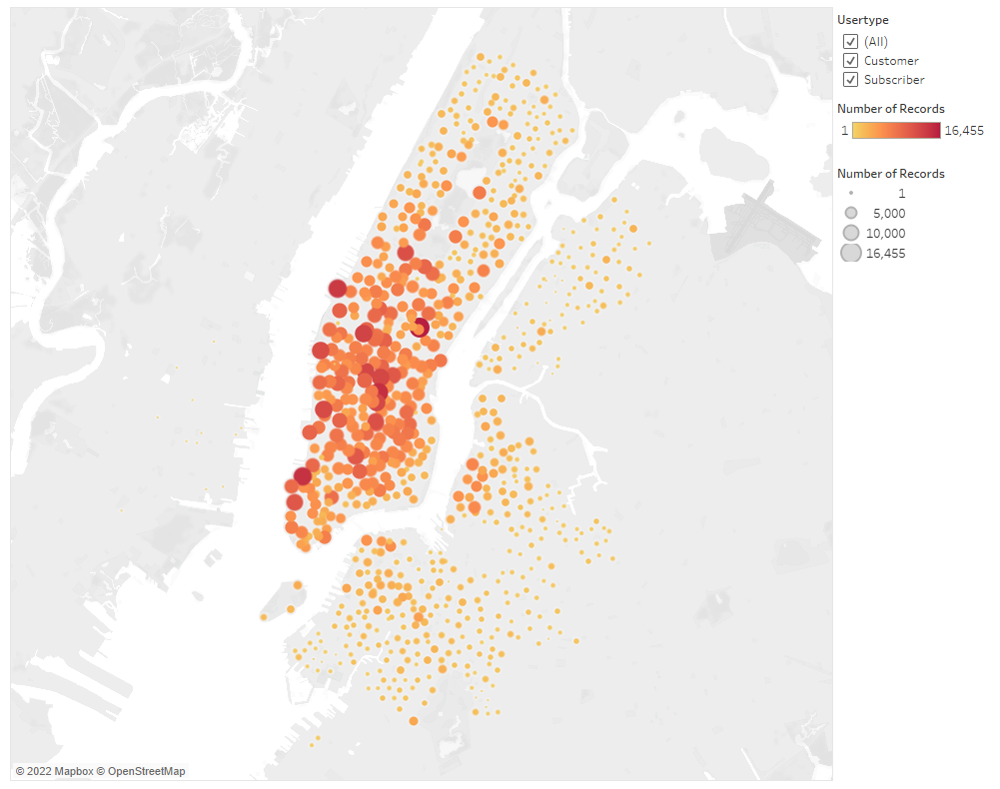

# NYC Citi Bike Program Analysis with Tableau

## Project Overview
In this project, we assist our friend Kate with our collaborative idea of starting a bike-share business in Des Moines, Iowa. To do this, we analyzed Citi bike data from August 2019 in New York City to develop visualizations to pitch to an angel investor using Tableau.

To better persuade stakeholders to invest in our business, we look to answer the following questions from the data:

1. How long are bikes checked out for all riders and genders?
2. How many trips are taken by the hour for each day of the week, for all riders and genders?
3. How many bike trips occur for each type of user and gender for each day of the week?
 

### Data Source: https://s3.amazonaws.com/tripdata/index.html
 

## Results

### Tableau Dashboard: [link to dashboard](https://public.tableau.com/app/profile/maher6211/viz/Module-15-Challenge/CheckoutTimesforUsers)
 

The following image visualizes the amount of bikes checked out and the trip duration of riders. As shown, most riders spend anywhere from a few minutes to 20-25 on the bike, with the most bikes used for about 4-7 minutes.

 
The graph can also be filtered (on the right) to populate multiple hours of a trip duration. 
 

 

The below graph, similar to the one above, shows us the trip duration of the Citi bikes based on gender. Males, indicated by orange, typically check out more bikes than females (blue line). Though, both males and females have similar trip durations. 
 

 

The next image consists of a heatmap that darkens in areas of more concentration. This visualizes the frequency of bike usage at each hour interval across the entire week. The most bikes being accessed occur during the week between the hours of 7 and 9 am, then again between 5 and 7 pm, this most likely correlates with morning and evening commutes to and from work.

 

 
Similarly, this heatmap below allows us to see the frequency of bike usage throughout each day of the week, split by genders.

 

 

The next image consists of another heatmap. As shown, Subscribers tend to checkout more bikes than customers, we can predict that subscribers consist of more locals who tend to use the bikes on a daily/weekly basis. Corresponding to our previous chart, males have checked out more bikes than females. Subscriber males appear to be the most dominant in this dataset, with most bikes being checked out during the week. Wednesdays appear to have a slight decrease before spiking again on Thursday.

 

 

The following map indicates the starting locations of bike checkouts. The bigger and darker the value, the increased amount of riders checkout their bikes from that location. This map also has a filter on the right side to drill down further into a specific user type.

Filtering by 'Customer' only, the most frequent locations can be seen to be located around touristy areas of New York City, such as Central Park. By filtering out each user type except 'Subscriber', the locations are more diverse as one would expect with riders who use the service regularly.

 

 

Lastly, this map shows us the more frequent ending locations of bike checkouts. All characteristics resemble the 'Top Starting Locations' map as above, with filters and each bubble's size corresponding with the number of records.

 

 

## Summary of Findings

In conclusion, the data shows male subscribers are the predominant users of the NYC Citi Bike network. The bikes have an abundance of use on weekdays during hours of a typical business commute. This means most bikes are likely checked out by locals for their commute into office. Customers, most likely tourists, tend to checkout/return their bikes near touristy destinations.

This program would benefit in any city with daily commuters. Whether this replicated program would survive in Des Moines, IA depends on several factors such as population, current modes of transport, traffic, and weather. Additional information about Des Moines and the city would greatly benefit the determination if a bike-sharing system would be successful. Further research could also determine if any previous bike-sharing systems were attempted as well. 

As most trip durations in NYC last only a few minutes, it would be ideal to set up stations within an 8-12 minute bike ride in Des Moines.
 

## Recommendations
Suggested visualizations for further analysis

1. A visualization suggested for future analysis could include age data of riders to determine whether bike-sharing is more predominant in a typical age group. These findings can also be cross-checked with data from Des Moines to determine whether the city in Iowa would be successful and ensure the bikes are used.

2. Another visualization we suggest for future analysis would be to break down the traffic congestion in each city. As New York is a major city with a huge population, traffic is almost always imminent. With greater amounts of traffic, both locals and tourists would most likely opt into using a rental bike for a quick commute. Heavy traffic would greatly benefit a bike-sharing system.

Whether this idea would be successful in Des Moines, Iowa greatly depends on many factors listed above. The concept of business does exist and could greatly benefit both the company and the city of Des Moines.
